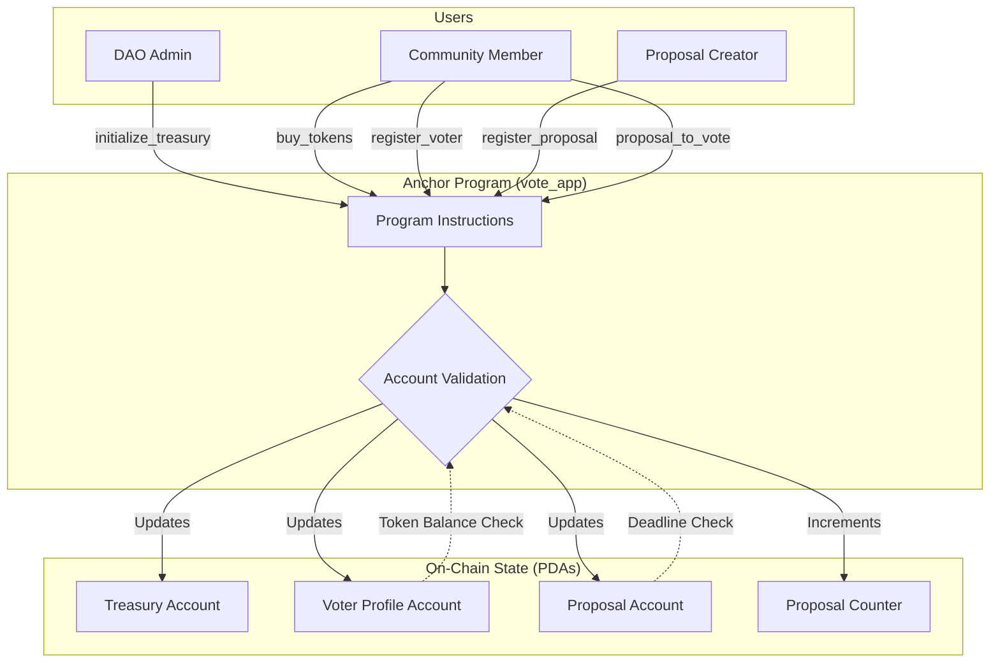

# Solana DAO Voting Platform

A sophisticated, decentralized autonomous organization (DAO) governance and voting system built on the Solana blockchain. This project enables seamless community-driven decision-making through on-chain proposals and token-weighted voting.

## 🚀 Overview

This platform empowers communities to manage their treasury and make collective decisions transparently. It features a robust Anchor-based smart contract on the Solana blockchain and a modern, lightning-fast Next.js frontend.

### Core Features

- **Treasury Management**: Initializable treasury with configurable token pricing and liquidity control.
- **Token Acquisition**: Integrated mechanism for users to purchase governance tokens using SOL.
- **Voter Registration**: Permissionless registration for community members to participate in governance.
- **Proposal Lifecycle**: 
  - **Create**: Submit detailed proposals with specific goals and token requirements.
  - **Vote**: Token-weighted voting mechanism to ensure stakeholder influence.
  - **Resolve**: Automated winner selection and proposal closure based on community input.
- **Full Transparency**: Every action, from token purchase to voting, is recorded immutably on the Solana ledger.

## 🔱 Anchor Program Deep Dive

The core logic of the DAO is handled by a sophisticated Anchor program that manages state, enforces governance rules, and handles financial transactions securely.

### Architecture Overview

The following diagram illustrates the relationship between users, program instructions, and on-chain state:



### Program Instructions & Capabilities


| Instruction | Category | Description |
|:---|:---|:---|
| `initialize_treasury` | **Admin** | Sets up the initial treasury state, including SOL price for tokens and tokens-per-purchase ratio. |
| `configure_treasury_token_account` | **Admin** | Configures the associated token account for the DAO's treasury to hold community tokens. |
| `withdraw_sol` | **Admin** | Allows the DAO authority to securely withdraw accumulated SOL from the treasury. |
| `buy_tokens` | **Economy** | A decentralized exchange mechanism allowing users to swap SOL for governance tokens instantly. |
| `register_voter` | **Governance** | Initializes a personal voter account for a user, enabling them to participate in DAO decisions. |
| `register_proposal` | **Governance** | Allows any community member to submit a proposal by defining its information, deadline, and required voter threshold. |
| `proposal_to_vote` | **Governance** | The heart of the DAO: allows voters to cast token-weighted votes on active proposals. |
| `pick_winner` | **Governance** | An automated resolution mechanism to process voting results once a proposal's conditions are met. |
| `close_proposal` | **Cleanup** | Securely closes spent proposal accounts to recover rent and optimize blockchain state. |
| `close_voter` | **Cleanup** | Allows users to deregister and reclaim SOL from their voter account rent. |

### Technical Highlights

- **PDA-Based Security**: Uses Program Derived Addresses (PDAs) for treasury and voter accounts ensuring that only the program can sign for critical state changes.
- **Strict Account Validation**: Leverages Anchor's powerful macros to validate every input account, preventing unauthorized access and common exploits.
- **Custom Error Handling**: A detailed suite of custom errors (`VoteError`) provides clear feedback for failed transactions like "Deadline Passed" or "Insufficient Tokens."
- **Event-Driven Design**: Emits structured events for all major actions, making it easy for frontends and indexers to track the live status of the DAO.
- **Space Optimization**: Carefully calculated account sizes to minimize rent costs for community members.


## 🛠 Tech Stack

### Smart Contract (Solana)
- **Framework**: [Anchor](https://www.anchor-lang.com/)
- **Language**: Rust
- **Program ID**: `HDrF2dTrJp5SEvDFy8YEk6E5vivj3DgaBNpUPebdGH9F`

### Frontend
- **Framework**: [Next.js 15+](https://nextjs.org/) (React 19)
- **Styling**: [Tailwind CSS v4](https://tailwindcss.com/)
- **Wallet Integration**: [@solana/wallet-adapter](https://github.com/solana-labs/wallet-adapter)
- **Icons**: [Lucide React](https://lucide.dev/)

## 📂 Project Structure

```text
├── app/                # Next.js Frontend
│   ├── src/
│   │   ├── app/        # Pages and routing
│   │   ├── features/   # Business logic components
│   │   ├── shared/     # Reusable UI components
│   │   └── types/      # TypeScript definitions
│   └── package.json    # Frontend dependencies
├── programs/           # Solana Programs (Anchor)
│   └── vote_app/
│       └── src/        # Rust source code
│           ├── contexts/   # Instruction context accounts
│           ├── instructions/# Implementation logic
│           ├── state/      # Account structures
│           └── lib.rs      # Program entry point
├── tests/              # Integration tests
├── migrations/         # Deployment scripts
├── Anchor.toml         # Anchor configuration
└── Cargo.toml          # Rust workspace configuration
```

## 🚦 Getting Started

### Prerequisites
- [Rust](https://www.rust-lang.org/tools/install)
- [Solana CLI](https://docs.solana.com/cli/install-solana-cli-tools)
- [Anchor CLI](https://www.anchor-lang.com/docs/installation)
- [Node.js](https://nodejs.org/) & [Yarn/NPM](https://yarnpkg.com/)

### Installation

1. **Clone the repository**
   ```bash
   git clone <repository-url>
   cd <repository-name>
   ```

2. **Install program dependencies**
   ```bash
   yarn install
   ```

3. **Install frontend dependencies**
   ```bash
   cd app && npm install
   ```

### Deployment & Testing

1. **Build the Solana program**
   ```bash
   anchor build
   ```

2. **Run tests**
   ```bash
   anchor test
   ```

3. **Deploy to Devnet**
   ```bash
   anchor deploy --provider.cluster devnet
   ```

4. **Launch the frontend**
   ```bash
   cd app
   npm run dev
   ```

## 🤝 Contributing

Contributions are welcome! Please feel free to submit a Pull Request.

## 📄 License

This project is licensed under the MIT License - see the LICENSE file for details.
